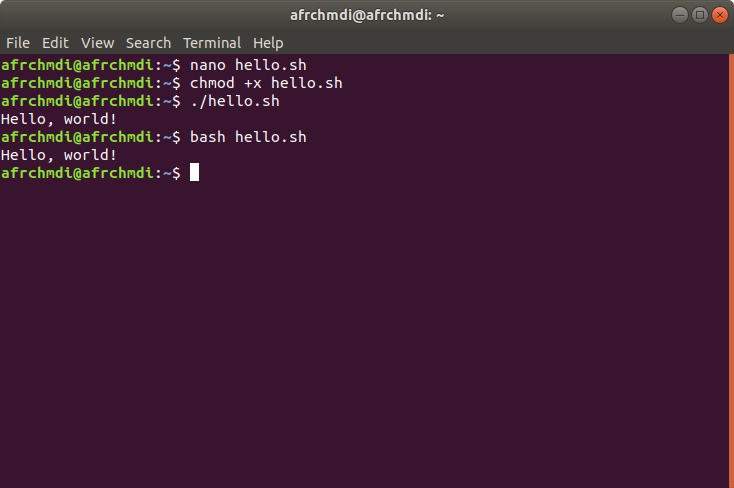
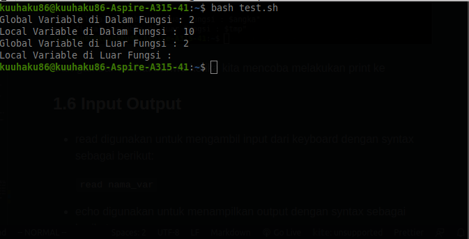
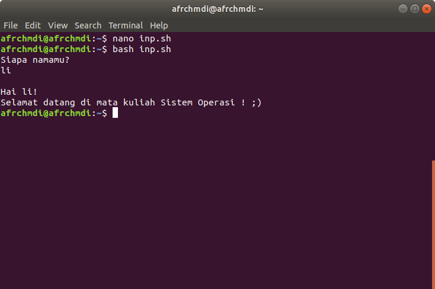
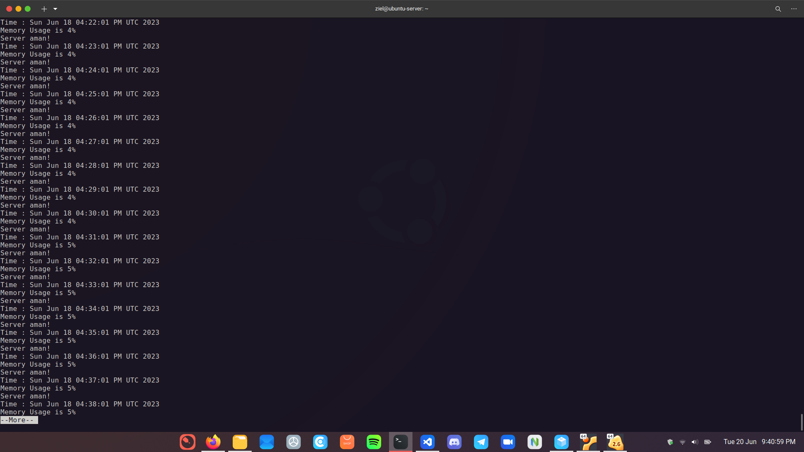

# Week 10. Shell Scripting, Cron, dan AWK
## Prasyarat

1. Menginstall OS Linux
2. Memahami CLI (_Command Line Interface_) [Modul Pengenalan CLI](https://github.com/fzl-22/Pemrograman-Sistem-Komputer_Informatika/blob/master/Modul%20Sistem%20Operasi/Week%209.%20Dasar%20CLI/README.md)

## Daftar Isi

- [Shell Scripting, Cron, dan AWK](#shell-scripting-cron-dan-awk)
  - [Prasyarat](#prasyarat)
  - [Daftar Isi](#daftar-isi)
- [1. Shell Scripting](#1-shell-scripting)
  - [1.1 Shell](#11-shell)
  - [1.2 Pemrograman Shell](#12-pemrograman-shell)
  - [1.3 Perintah Dasar Shell](#13-perintah-dasar-shell)
  - [1.4 Simple Shell Script](#14-simple-shell-script)
  - [1.5 Variabel](#15-variabel)
    - [1.5.1 Special Variable](#151-special-variable)
    - [1.5.2 Local Variable](#152-local-variable)
  - [1.6 Input Output](#16-input-output)
  - [1.7 Quoting](#17-quoting)
  - [1.8 Operator Dasar](#18-operator-dasar)
    - [1.8.1 Operator Aritmatika](#181-operator-aritmatika)
    - [1.8.2 Operator Relasional](#182-operator-relasional)
  - [1.9 Conditional Statements](#19-conditional-statements)
    - [1.9.1 If...Else](#191-ifelse)
    - [1.9.2 Case](#192-case)
  - [1.10 Loop](#110-loop)
    - [1.10.1 While loop](#1101-while-loop)
    - [1.10.2 For loop](#1102-for-loop)
    - [1.10.3 Until loop](#1103-until-loop)
    - [1.10.4 Select loop](#1104-select-loop)
    - [1.10.5 Nesting Loops](#1105-nesting-loops)
  - [1.11 Function](#111-function)
    - [1.11.1 Nested Functions](#1111-nested-functions)
- [2. Cron](#2-cron)
  - [2.1 Membuat atau mengubah cron jobs](#21-membuat-atau-mengubah-cron-jobs)
- [3. AWK](#3-awk)
  - [3.1 Menjalankan Program AWK](#31-menjalankan-program-awk)
    - [Cara Kerja AWK](#cara-kerja-awk)
  - [3.2 Special Rules](#32-special-rules)
- [Tugas](#tugas)
- [Referensi](#referensi)

# 1. Shell Scripting
## 1.1 Shell
Sistem operasi dibagi menjadi tiga komponen penting, yaitu Kernel, Shell, dan System Utility.


- __Kernel__ adalah inti dari komputer. Komponen ini memungkinkan terjadinya komunikasi antara software dan hardware. Jika kernel adalah bagian terdalam dari sebuah sistem operasi, maka __shell__ adalah bagian terluarnya.
- __Shell__ adalah program penerjemah perintah yang menjembatani user dengan kernel. Umumnya, shell menyediakan __prompt__ sebagai user interface tempat user menginputkan perintah-perintah yang diinginkan, baik berupa perintah internal maupun eksternal. Setelah menerima input dari user dan menjalankan program/perintah berdasarkan input tersebut, shell akan mengeluarkan output. Shell dapat diakses melalui __Terminal__.
- __System Utility__ adalah system software yang menjalankan tugas-tugas maintenance. System utility ini dibuat secara khusus untuk melakukan fungsi tertentu pada suatu area komputasi secara spesifik, seperti memformat harddisk, atau melakukan pengecekan konektivitas jaringan dll.

` Catatan: Apabila kamu mennyalakan Ubuntu Server yang secara default adalah terminal-based, maka kamu akan menemukan prompt shell (biasanya $). Disitu, kamu dapat mengetik input berupa perintah, kemudian mengeksekusinya dengan menekan tombol "Enter". Output akan ditampilkan di terminal. `

Ada 2 tipe shell utama di Unix/Linux, yaitu:

1. Bourne Shell - Prompt untuk shell ini adalah $ 
    - Bourne Shell (`sh`)
    - POSIX Shell (`sh`)
    - Korn Shell (`ksh`)
    - Bourne Again Shell (`bash`), terminal paling banyak digunakan oleh distro Linux
    - Z Shell (`zsh`), terminal default MacOS
2. C Shell - Prompt untuk shell ini adalah %
    - C Shell (`csh`)
    - TENEX/TOPS C Shell (`tcsh`)
## 1.2 Pemrograman Shell
Pemrograman shell adalah penyusunan beberapa perintah shell (internal maupun eksternal) menjadi serangkaian perintah untuk melakukan tugas tertentu.
Kelebihan shell di Linux adalah memungkinkan user untuk menyusun serangkaian perintah seperti halnya bahasa pemrograman interpreter, yakni melakukan proses input output, menyeleksi kondisi (decision making), looping, membuat fungsi, dsb.

Pemrograman shell di Unix/Linux juga disebut dengan shell scripting. Untuk memudahkan, shell script dapat disimpan ke dalam sebuah file yang dapat dieksekusi kapanpun kita inginkan.
    
Manfaat belajar shell scripting:

- Dapat bekerja secara efektif dan efisien karena tidak perlu mengetik serangkaian perintah secara berulang-ulang, cukup menulis dan mengeksekusi satu file saja

- Dapat menjalankan beberapa perintah sebagai satu perintah

- Dapat menjalankan perintah secara otomatis dengan bantuan automasi seperti `cron job`.
## 1.3 Perintah Dasar Shell
Pada modul ini jenis shell yang digunakan adalah Bash (_Bourne Again SHell_) karena bash paling banyak digunakan dalam distro Linux. Untuk mengecek shell apa yang sedang kalian gunakan, bisa dengan menggunakan 

```bash
$ echo $SHELL
```

Shell memiliki perintah internal (built-in shell) dan perintah eksternal. Untuk lebih jelasnya :
- Perintah internal (built-in shell) : Perintah yang dibangun di dalam shell. Eksekusi tidak harus mencari perintah dari variabel PATH yang di ada di shell
- Perintah eksternal : Perintah yang tidak ada di dalam shell. Ketika perintah dijalankan, shell akan mencari perintah tersebut dalam variable PATH seperti `/usr/bin` dan `/bin`.

Untuk mengecek apakah sebuah perintah termasuk internal atau eksternal, gunakan perintah type

```bash
$ type cd
cd is a shell builtin
$ type bash
bash is /bin/bash
$ type read
read is a shell builtin 
$ type chmod
chmod is /bin/chmod
```

- Contoh perintah internal: 

    cd, pwd, times, alias, umask, exit, logout, fg, bg, ls, mkdir, rmdir, mv, cp, rm, clear, ...

- Contoh perintah eksternal: 

    cat, cut, paste, chmod, lpr,.... 


Selain itu, terdapat beberapa karakter yang cukup penting untuk digunakan dalam shell:

- __Redirection__ (mengirim output ke file atau menerima input dari file) menggunakan operator redirect >, >>, <, 2>> contoh:

```bash
ls /home/Documents > test.txt
#hasil output ls dari directori /home/Documents dikirim ke file test.txt. jika file belum ada akan dibuat, tetapi jika sudah ada, isinya akan ditimpa

ls /home/Documents >> test.txt
#hampir sama, bedanya jika file sudah ada maka isinya akan ditambah di akhir file

sort < test.txt
#file test.txt dijadikan input oleh perintah sort

bash script.sh 2>> error.log
#Jika terdapat error saat menjalankan script.sh, pesan error akan masuk ke error.log
```

- __Pipe__ (output suatu perintah menjadi input perintah lain) menggunakan operator |, contoh:
```bash
ls -l | sort -s
#ouput perintah ls -l menjadi input perintah sort -s (urutkan secara descending)
```
- __Wildcard__ menggunakan karakter *, ?, [ ], contoh:
```bash
ls a*
#tampilkan semua file yang dimulai dengan a

ls a?a
#tampilkan file yang dimulai dengan a, kemudian sembarang karakter tunggal, dan diakhiri dengan a

ls [re]*
#tampilkan file yang dimulai dengan salah satu karakter r atau e
```
Untuk melihat informasi selengkapnya tentang bash shell, silahkan membuka manual bash dengan cara:

```bash
$ man bash
```

## 1.4 Simple Shell Script
Buatlah sebuah file berekstensi .sh menggunakan editor apapun, misalnya nano, vi, atau gedit.

```bash
$ nano nama_file.sh
```
Misalnya:

`
$ nano hello.sh
`

Tulis beberapa baris perintah disana, diawali dengan shebang `#!/bin/bash`. 

Shebang berfungsi untuk memberitahu sistem bahwa perintah-perintah yg ada di dalam file tersebut harus dijalankan oleh Bash.

```bash
#!/bin/bash
echo "Hello, world!"
```

Simpan dan ubah permission file script agar dapat dieksekusi.
```bash
$ chmod +x hello.sh
```
Eksekusi file script dengan cara ./nama_file.sh atau bash nama_file.sh.



## 1.5 Variabel
- Beberapa hal yang perlu diperhatikan dalam mendefinisikan variabel:

    i. Nama variabel hanya boleh terdiri dari:
    - Huruf (a-z dan A-Z)
    - Angka (0-9)
    - Karakter underscore (_)
    
    ii.  Nama variabel dimulai dengan huruf atau underscore
    
    iii. Tidak boleh menggunakan karakter spesial seperti !, *, $, #, -, dll karena karakter tersebut punya makna khusus untuk shell

    iv. Bersifat case sensitive (membedakan huruf besar dan kecil)

- Syntax

    - Mendefinisikan variabel
    ```
    nama_var=nilai
    ```
    - Mengakses variabel
    ```
    $nama_var
    ```
- Tipe-Tipe Variabel
    - String
    ```
    nama_var="string"
    ```
    - Integer
    ```
    nama_var=nilai
    ```
    - Array
        
        #Jika isi array berupa string
    
        nama_var=("string0" "string1" "string2" ... "stringN")

        #Jika isi array berupa integer
        
        nama_var=(nilai0 nilai1 nilai2 ... nilaiN)    

Contoh:
```bash
#!/bin/bash

mata_kuliah="Sistem Operasi"
semester=12
mahasiswa=("Jamal" "Taufik" "Dobleh" "Kabur")

echo "Variabel string:" $mata_kuliah
echo "Variabel integer:" $semester
echo "Variabel array ke-1:" ${mahasiswa[2]}
```
Output:


### 1.5.1 Special Variable
Beberapa special variable yang sering dipakai:

| Variable                                        | Deskripsi                                                                            |
| --------------------------------------------------------- |:--------------------------------------------------------------------------------------- |
|   $0   | Berisi nama file script yang sedang dijalankan
|   $n   | n disini adalah angka desimal positif yang sesuai dengan posisi argumen (argumen pertama adalah $1, argumen kedua adalah $2, dst)
|   $#   | Jumlah argumen yang diinput pada script
|   $*   | Semua argumen $n
|   $?   | Status exit dari perintah terakhir yang dijalankan
|   $$   | Proses ID (PID) shell saat ini


Contoh:
```bash
#!/bin/bash

echo "Nama script : $0"
echo "Argumen ke-1 : $1"
echo "Argumen ke-2 : $2"
echo "Hai $1, selamat datang di kelas $2!"
echo "Total argumen : $#"
echo "Semua argumen : $*"
echo "PID : $$" 
```
Output:


### 1.5.2 Local Variable
Ketika menggunakan bash, variabel akan otomatis menjadi variabel global jika di-assign secara langsung seperti `bulan=6`. Tetapi kita bisa membuat variabel lokal untuk fungsi di bash dengan menggunakan keyword `local`. Variabel lokal yang terbuat tidak akan menjadi variabel global.

Contoh:

```bash
#!/bin/bash

fac_func() {
    angka=2
    local tmp=10
    echo "Global Variable di Dalam Fungsi : $angka"
    echo "Local Variable di Dalam Fungsi : $tmp"
}

fac_func

echo "Global Variable di Luar Fungsi : $angka"
echo "Local Variable di Luar Fungsi : $tmp"
```

Output:



Dari gambar terlihat bahwa ketika kita mencoba melakukan print local variable ke terminal tidak bisa keluar.

## 1.6 Input Output
- read digunakan untuk mengambil input dari keyboard dengan syntax sebagai berikut:

    `read nama_var`

- echo digunakan untuk menampilkan output dengan syntax sebagai berikut:

    #Menampilkan teks biasa

    `echo "teks"`

    #Menampilkan isi dari sebuah variabel

    `echo $nama_var`

Catatan:

Jika ingin menggunakan new line character (\n) pada echo, gunakan echo -e "teks\n teks"

Contoh:
```bash
#!/bin/bash

matakuliah="Sistem Operasi"

echo "Siapa namamu?"
read nama
echo -e "\nHai $nama!\nSelamat datang di mata kuliah $matakuliah ! ;)"
```
Output:



Selain echo, bash juga menyediakan perintah builtin printf untuk menampilkan output dengan format tertentu, mirip bahasa C. Contoh:
```bash
#!/bin/bash

matkul="Sistem Operasi";
angka=12;

printf "Ini enter\n\tdi bash\n";
printf "Matakuliah apa? %s\n" $matkul;
printf "%d decimal dalam float = %.2f\n" $angka $angka
```
Output:


## 1.7 Quoting
Shell Unix/Linux memiliki beberapa karakter spesial yang disebut dengan **metakarakter**. Karakter tersebut punya makna khusus jika digunakan di dalam shell script. Beberapa macam metakarakter:
```bash
* ? [ ] ' " \ $ ; & ( ) | ^ < > new-line space tab
```

Ada 4 jenis **quoting**, yaitu:

| No | Quoting | Deskripsi|
|---|---|---|
| 1 | Single Quote (') | Semua metakarakter di antara single quote akan kehilangan makna khusus |
| 2 | Double Quote (") | Sebagian besar metakarakter di antara double quote akan kehilangan makna khusus, kecuali `$, backquote, \$, \', \", \\` |
| 3 | Backslash (\\) | Karakter apa pun setelah backslash akan kehilangan makna khusus |
| 4 | Backquote (`) | Apa pun di antara back quote akan diperlakukan sebagai perintah dan akan dieksekusi |

Contoh:   
```bash
#!/bin/bash

single=3

#Single quote
echo '$single'

#Double quote
echo "$single"

#Backslash
echo \<-\$1500.\*\*\>\; \(update\?\) \[y\|n\]

#Backquote
dmn=`pwd`
echo "Dimana kita? " $dmn
```

Output:   


Lebih banyak dapat dilihat sendiri di `man bash`

## 1.8 Operator Dasar
Ada beberapa jenis operator yang didukung oleh shell, yaitu:
  1. Operator Aritmatika
  2. Operator Relasional
  3. Operator Boolean
  4. Operator String
  5. Operator File Test

Namun yang akan dibahas lebih jauh hanyalah operator **aritmatika** dan **relasional**.

### 1.8.1 Operator Aritmatika

| No | Operator | Deskripsi |
|---|---|---|
| 1 | + | Penjumlahan |
| 2 | - | Pengurangan |
| 3 | * | Perkalian |
| 4 | / | Pembagian |
| 5 | % | Modulus (sisa pembagian) |
| 6 | = | Menempatkan nilai di sisi kanan ke variabel di sisi kiri |
| 7 | == | Membandingkan 2 nilai yang sama |
| 8 | != | Membandingkan 2 nilai yang tidak sama |

Ada 3 cara yang dapat digunakan untuk melakukan operasi matematika, yaitu:
1. Menggunakan perintah built-in **let**
2. Menggunakan perintah eksternal **expr** 
3. Menggunakan perintah subtitusi ` $((ekspresi))`

Contoh:   
```bash
#!/bin/bash

a=15
b=7

#memakai let
let jumlah=$a+$b
let kurang=$a-$b
let kali=$a*$b

#memakai expr
bagi=`expr $a / $b`

#memakai perintah subtitusi $((ekspresi))
mod=$(($a % $b)) 

echo "a + b = $jumlah"
echo "a - b = $kurang"
echo "a * b = $kali"
echo "a / b = $bagi"
echo "a % b = $mod"

b=$a

echo "a = $a"
echo "b = $b"
```

Output:


### 1.8.2 Operator Relasional

| No | Operator | Deskripsi | 
|---|---|---|
| 1 | -eq | Memeriksa apakah nilai kedua operan sama (==) |
| 2 | -ne | Memeriksa apakah nilai kedua operan tidak sama (!=) |
| 3 | -gt | Memeriksa apakah nilai operan kiri lebih besar daripada operan kanan (>) |
| 4 | -lt | Memeriksa apakah nilai operan kiri lebih kecil daripada operan kanan (<)  |
| 5 | -ge | Memeriksa apakah nilai operan kiri lebih besar atau sama dengan operan kanan (>=) |
| 6 | -le | Memeriksa apakah nilai operan kiri lebih kecil atau sama dengan operan kanan (<=) |

Operator relasional biasanya digunakan bersama dengan conditional statements, contoh:   
```bash
#!/bin/bash

a=15
b=7

if [ $a -eq $b ]
then
  echo "$a -eq $b: a sama dengan b"
else
  echo "$a -eq $b: a tidak sama dengan b"
fi
```
Output:   
```bash
15 -eq 7: a tidak sama dengan b
```

## 1.9 Conditional Statements
**Conditional statements** digunakan untuk memungkinkan program dapat membuat keputusan yang benar dengan memilih tindakan tertentu berdasarkan syarat/kondisi tertentu.
Ada 2 jenis conditional statements dalam Unix shell, yaitu:
1. **if...else**
2. **case**
  
### 1.9.1 If...Else
Syntax:
```bash
if [ kondisi1 ]
then 
  perintah1 
elif [ kondisi2 ]
then
  perintah2 
else
  alternatif_perintah
fi
```
Contoh:
```bash
#!/bin/bash

cintaku=100
cintanya=88

if [ $cintaku == $cintanya ]
then
  echo "cintaku sama dengan cintanya"
elif [ $cintaku -gt $cintanya ]
then
  echo "cintaku lebih besar dari cintanya"
elif [ $a -lt $cintanya ]
then
  echo "cintaku lebih kecil dari cintanya"
else
  echo "Tidak ada kondisi yang memenuhi"
fi
```
Output:
```bash
cintaku lebih besar dari cintanya
```

### 1.9.2 Case
Syntax:
```bash
case var in
  pola1)
    perintah1 
    ;;
  pola2)
    perintah2 
    ;;
  *)
    alternatif_perintah
    ;;
esac
```
Contoh:
```bash
#!/bin/bash

echo "Aku udah suka sama kamu dari lama, kamu mau ga jadi pacar aku?"
echo "1. Ya"
echo "2. Tidak"
echo "3. Aku gak bisa jawab sekarang"
echo -n "jawab: "
read jawaban

case "$jawaban" in
  "1")
    echo "Ga ada hal yang lebih aku tunggu dari ini, terimakasih!!!"
    ;;
  "2")
    echo "Oke, maaf ya udah ganggu waktu kamu"
    ;;
  "3")
    echo "Gantung aja aku, gantung aja!!!"
    ;;
  *)
    echo "Apa apa? Gimana??"
    ;;
esac
```
Output:   


## 1.10 Loop
**Loop** digunakan untuk mengeksekusi serangkaian perintah berulang kali. Ada beberapa macam shell loops:
  1. While loop
  2. For loop
  3. Until loop
  4. Select loop

### 1.10.1 While loop
**While loop** digunakan untuk mengeksekusi serangkaian perintah berulang kali **selama** suatu kondisi terpenuhi. While digunakan jika kita ingin memanipulasi suatu variabel secara berulang-ulang.
Syntax:
```bash
while kondisi
do
  perintah 
done
```
Contoh:
```bash
#!/bin/bash

a=0

while [ $a -lt 10 ]
do
echo $a
  a=$((a + 2))
done
```
Output:
```bash
0
2
4
6
8
```
### 1.10.2 For loop
**For loop** digunakan untuk mengulang serangkaian perintah untuk setiap item pada daftar.
Syntax:
```bash
for var in daftar_item
do
  perintah 
done
```
Contoh:
```bash
#!/bin/bash

for num in 1 2 3 4 5
do
  echo $num
done
```
Selain itu, bisa ditulis seperti ini:
```bash
#!/bin/bash

for ((num=1; num<=5; num=num+1))
do
  echo $num
done
```
Output:
```bash
1
2
3
4
5
```

### 1.10.3 Until loop
Berbeda dengan while, **until loop** digunakan untuk mengeksekusi serangkaian perintah berulang kali **sampai** suatu kondisi terpenuhi.
Syntax:
```bash
until kondisi
do
  perintah
done
```
Contoh:
```bash
#!/bin/bash

a=0

until [ ! $a -lt 10 ]
do
  echo $a
  a=$((a + 2))
done
```
Output:
```bash
0
2
4
6
8
```

### 1.10.4 Select loop
**Select loop** digunakan ketika kita ingin membuat sebuah program dengan beberapa daftar pilihan yang bisa dipilih oleh user, misalnya daftar menu.
Syntax:
```bash
select var in daftar_item
do
  perintah
done
```
Contoh:
```bash
#!/bin/bash

select minuman in teh kopi air jus susu semua gaada
do
  case $minuman in
    teh|kopi|air|semua)
      echo "Maaf, habis"
      ;;
    jus|susu)
      echo "Tersedia"
    ;;
    gaada)
      break
    ;;
    *) echo "Tidak ada di daftar menu"
    ;;
  esac
done
```
Output:   


### 1.10.5 Nesting Loops
Semua jenis loop di atas mendukung konsep nesting, artinya kita dapat menempatkan satu loop ke dalam loop lain, baik loop yang sejenis maupun berbeda jenis
Contoh:
```bash
#!/bin/sh

a=0

while [ "$a" -lt 10 ]  #loop1
do
  b="$a"
  while [ "$b" -ge 0 ]  #loop2
  do
    echo -n "$b "
    b=`expr $b - 1`
  done
  echo ""
  a=`expr $a + 1`
done
```
Output:
```bash
0
1 0
2 1 0
3 2 1 0
4 3 2 1 0
5 4 3 2 1 0
6 5 4 3 2 1 0
7 6 5 4 3 2 1 0
8 7 6 5 4 3 2 1 0
9 8 7 6 5 4 3 2 1 0
```
## 1.11 Function
**Fungsi** digunakan untuk memecah fungsionalitas keseluruhan script menjadi sub-bagian yang lebih kecil. Sub-bagian itu dapat dipanggil untuk melakukan tugas masing-masing apabila diperlukan.
Syntax:
```bash
nama_fungsi () { 
  perintah1
  perintah2
  ...
  perintahN
}
```
Contoh:
```bash
#!/bin/bash
#define functions
ask_name() {
  echo "Siapa namamu?"
}
reply() {
  read nama
  echo "Hai $nama, selamat datang di praktikum sistem operasi!"  
}

#call functions
ask_name
reply
```
Output:   


### 1.11.1 Nested Functions
Sama halnya dengan loop, function juga bisa menerapkan konsep nested. Dimana kita bisa memanggil sebuah fungsi di dalam fungsi.
```bash
#!/bin/bash

#define functions
ask_name() {
  echo "Siapa namamu?"
  reply   #call reply function inside ask_name function
}
reply() {
  read nama
  echo "Hai $nama, selamat datang di praktikum sistem operasi!"
}

#call functions
ask_name
```
Output:   


# 2. Cron
Cron adalah sebuah service daemon yang memungkinkan user Linux dan Unix untuk menjalankan perintah atau _script_ pada waktu tertentu secara otomatis. Perintah-perintah dan/atau script-script yang dijalankan cron disebut cron jobs.
Syntax crontab :
`crontab [-u user] [-l | -r | -e] [-i]`
Penjelasan :
* `-l` untuk menampilkan isi file crontab
* `-r` untuk menghapus file crontab
* `-e` untuk mengubah atau membuat file crontab jika belum ada
* `-i` untuk memberikan pertanyaan konfirmasi terlebih dahulu sebelum menghapus file crontab
## 2.1 Membuat atau mengubah cron jobs
1. Ketikkan `crontab -e`
2. Ketikkan perintah crontab sesuai aturan parameter crontab   
   
3. Untuk melihat daftar cron jobs ketikkan `crontab -l`
4. Sayangnya, cron job tidak akan menampilkan error pada terminal jika terjadi masalah. Kita perlu memeriksa errornya di file `/var/log/syslog` karena log dari setiap eksekusi cron jobs akan otomatis tertulis di sana. Untuk memeriksanya, ketikan perintah berikut: `cat /var/log/syslog | grep -i CRON`

Contoh perintah yang dijalankan crontab   
   
Penjelasan :
* setiap jam 00.00 memasukkan hasil `ls /home/tamtama` ke file `/home/tamtama/list_files`
* setiap minggu menjalankan file `script.sh` pada folder `/home/tamtama`

Untuk belajar lebih lanjut perintah-perintah crontab bisa mengakses website [crontab guru](https://crontab.guru/).   


Apabila ingin mengedit file crontab untuk user tertentu, gunakan perintah `sudo crontab -u <user> -e`. Sedangkan, untuk melihat daftar cronjob dari user tertentu dapat menggunakan perintah `sudo crontab -u <user> -l`.

Sebagai contoh, apabila ingin mengedit file crontab dari user root, maka dapat menggunakan perintah berikut:

```Bash
sudo crontab -u root -e
```

# 3. AWK
__awk__ merupakan sebuah program yang bisa digunakan untuk mengambil catatan/record tertentu dalam sebuah file dan melakukan sebuah/beberapa operasi terhadap catatan/record tersebut.

Fungsi dasar awk adalah memeriksa sebuah file per barisnya (atau satuan teks lain) yang mengandung pola tertentu. Ketika sebuah baris cocok dengan salah satu pola, awk akan melakukan action tertentu pada baris tersebut. awk melanjutkan proses sampai menemui end of file pada file yang menjadi masukan tadi.

FYI: awk versi baru dinamakan gawk, tapi biasanya tetap disebut awk.

Awk adalah bahasa scripting yang digunakan untuk memanipulasi data dan menghasilkan laporan. Bahasa pemrograman perintah awk tidak memerlukan kompilasi, dan memungkinkan pengguna untuk menggunakan variabel, fungsi numerik, fungsi string, dan operator logika. Awk sebagian besar digunakan untuk pemindaian dan pemrosesan pola.

## 3.1 Menjalankan Program AWK
Syntax:
```bash
awk options 'selection _criteria {action }' input-file > output-file
```
### Cara Kerja AWK
- Awk membaca baris dalam sebuah file.

- Untuk beberapa baris, ini dicocokkan dengan pola yang dibuat. Jika polanya cocok maka keputusan selanjutnya bisa dilakukan, seperti print misalnya.

- Jika tidak ada pola yang cocok, maka tidak ada action/keputusan yang akan diambil.

- Memberikan pola atau action tidak diharuskan.

- Jika tidak ada pola yang dibuat, maka output default nya adalah setiap baris dari file yang anda pakai.

- Jika tidak ada action/keputusan yang dibuat, maka output default nya adalah memunculkan hasil pencarian pada layar anda.

- Kurung kurawal tanpa action itu artinya tidak ada keputusan, tapi tidak akan memunculkan output default tadi.

- Setiap statemen dalam action harus di pisahkan dengan tanda titik koma (;)

Misalnya kita memiliki data kerajaan sebagai berikut:
```
mataram sanjaya 732 760
kutai mulawarman  400 446
singasari ken 1222 1227
majapahit gajahmada 1334 1364
tarumanegara sanjaya 732 754
sriwijaya balaputradewa 792 835
```
Secara default awk akan print semua baris pada file masukan:  
`awk '{print}' kerajaan.txt`  

Print baris yang mengandung pola yang dimasukkan:
`awk '/sanjaya/ {print}' kerajaan.txt`  
Maka hasilnya adalah sebagai berikut:
```
mataram sanjaya 732 760
tarumanegara sanjaya 732 754
```
Dalam setiap baris, awk akan membagi setiap kata yang dipisahkan oleh spasi dan menyimpannya pada variabel $n. Jika terdapat 4 kata pada satu baris, maka kata pertama akan disimpan pada variabel $1, kata kedua pada variabel $2, dan seterusnya. $0 merepresentasikan semua kata yang ada pada satu baris.

`awk '/ken/ {print $1,$2}' kerajaan.txt`  
Maka hasilnya adalah sebagai berikut:
```
singasari ken
```
Catatan: Dalam rule program awk boleh menghilangkan hanya salah satu di antara action atau pola. Jika pola dihilangkan, maka action akan diberlakukan ke semua baris. Sedangkan jika action dihilangkan, maka setiap baris yang mengandung pola tersebut akan secara default ditampilkan secara penuh.

## 3.2 Special Rules
Program awk memiliki rule yang memiliki kelakuan khusus. Di antaranya adalah BEGIN dan END. Rule BEGIN hanya dieksekusi satu kali, yaitu sebelum input dibaca. Rule END pun juga dieksekusi satu kali, hanya setelah semua input selesai dibaca. Contoh:
```bash
awk '
BEGIN { print "Ada berapa \"732\"?" }
/732/  { ++n }
END   { print "\"732\" muncul", n, "kali." }' kerajaan.txt
```
Maka hasilnya adalah sebagai berikut:
```
Ada berapa "732"?

"732" muncul 2 kali.
```
Pada contoh di atas, rule kedua hanya memiliki action untuk melakukan perhitungan berapa jumlah baris yang mengandung "732", namun tidak ada action untuk menampilkan (print).

## Tugas


Kamu adalah seorang System Administrator di sebuah warung pecel lele di Ketintang. Sebagai seorang SysAdmin, sudah sepatutnya kamu akan diberi tugas untuk melakukan pemeliharaan server dari warung tersebut. Untuk itu, kamu ditugaskan untuk melakukan 2 hal berikut:

1. Karena bos kamu tidak suka melihat warungnya menggunakan software yang out-dated, maka dia menyuruhmu untuk membuat automasi menggunakan cronjob untuk melakukan system upgrade setiap hari Jum'at pukul 23.59 (ingat bahwa system upgrade hanya bisa dilakukan oleh user root atau privileged user dengan password), dengan syarat sebagai berikut:
    - Script berada di `/root` dengan nama `system-upgrade.sh`
    - Output dari script diarahkan ke file `system-upgrade.log` menggunakan append output redirection (>>) di direktori yang sama. Outputkan juga kapan waktu saat dijalankannya script tersebut menggunakan `date`.
    - Error dari script diarahkan ke file `system-upgrade.error` menggunakan append error redirection (2>>) di direktori yang sama.
2. Bos kamu juga merupakan orang yang mudah khawatir, sehingga ia sangat takut apabila server warungnya down. Oleh karena itu, ia ingin kamu membuatkan script untuk memeriksa penggunaan memory setiap menit dalam persentase. Ia ingin diberikan peringatan dengan rincian sebagai berikut:

    - Jika penggunaan memory `0% < memory <= 50%``0% < memory <= 50%`, outputkan "Server aman!".
    - Jika penggunaan memory `50% < memory <= 80%`, outputkan "Telah melewati batas aman!".
    - Jika penggunaan memory `memory > 80%`, outputkan "Hati-hati sistem down!"
    - Script bernama `pecel-lele-script.sh` dan outputnya diarahkan menggunakan append output redirection ke file `pecel-lele-script.log`. Kedua file ini berada di direktori `~/Documents`.
    - Manfaatkan command `free` (untuk melihat penggunaan memory), `awk`, dan `cron`. Dilarang menggunakan `grep`.
  
Buatlah dokumentasi untuk melakukan kedua hal di atas sehingga bos kamu dapat menjadi lebih tenang dan warung pecel lele-nya bisa dinikmati oleh semua orang di Ketintang.

Dokumentasi yang telah kalian buat dikumpulkan ke form berikut:

// Form Pengumpulan

Penilaian diambil dari:

1. Kesesuaian dengan instruksi dan kerincian penjelasan (80%).
2. Estetika dan kerapian dokumentasi (20%).

Contoh output dari cron job:

Soal 1.


Soal 2.




## Referensi
* [https://www.tutorialspoint.com/unix/shell_scripting.htm](https://www.tutorialspoint.com/unix/shell_scripting.htm)
* [https://pemula.linux.or.id/programming/bash-shell.html](https://pemula.linux.or.id/programming/bash-shell.html)
* [https://www.computerhope.com/unix/ucrontab.htm](https://www.computerhope.com/unix/ucrontab.htm)
* [https://www.codepolitan.com/memahami-perintah-perintah-crontab-paling-lengkap-59f69445130a0](https://www.codepolitan.com/memahami-perintah-perintah-crontab-paling-lengkap-59f69445130a0)
* [https://vpswp.blogspot.com/2015/06/definisi-dan-6-contoh-fungsi-perintah-awk-linux.html](https://vpswp.blogspot.com/2015/06/definisi-dan-6-contoh-fungsi-perintah-awk-linux.html)
* [https://www.codepolitan.com/belajar-bash-mencoba-bash-untuk-pertama-kali-57bbca3c28e54-17341](https://www.codepolitan.com/belajar-bash-mencoba-bash-untuk-pertama-kali-57bbca3c28e54-17341)
* [https://pemula.linux.or.id/programming/bash-shell.html](https://pemula.linux.or.id/programming/bash-shell.html)
* [https://github.com/ranger/ranger](https://github.com/ranger/ranger)
* [https://www.geeksforgeeks.org/internal-and-external-commands-in-linux/#:~:text=The%20UNIX%20system%20is%20command,are%20built%20into%20the%20shell.&text=External%20Commands%20%3A%20Commands%20which%20aren't%20built%20into%20the%20shell](https://www.geeksforgeeks.org/internal-and-external-commands-in-linux/#:~:text=The%20UNIX%20system%20is%20command,are%20built%20into%20the%20shell.&text=External%20Commands%20%3A%20Commands%20which%20aren't%20built%20into%20the%20shell)
* [https://tldp.org/LDP/abs/html/localvar.html](https://tldp.org/LDP/abs/html/localvar.html)


